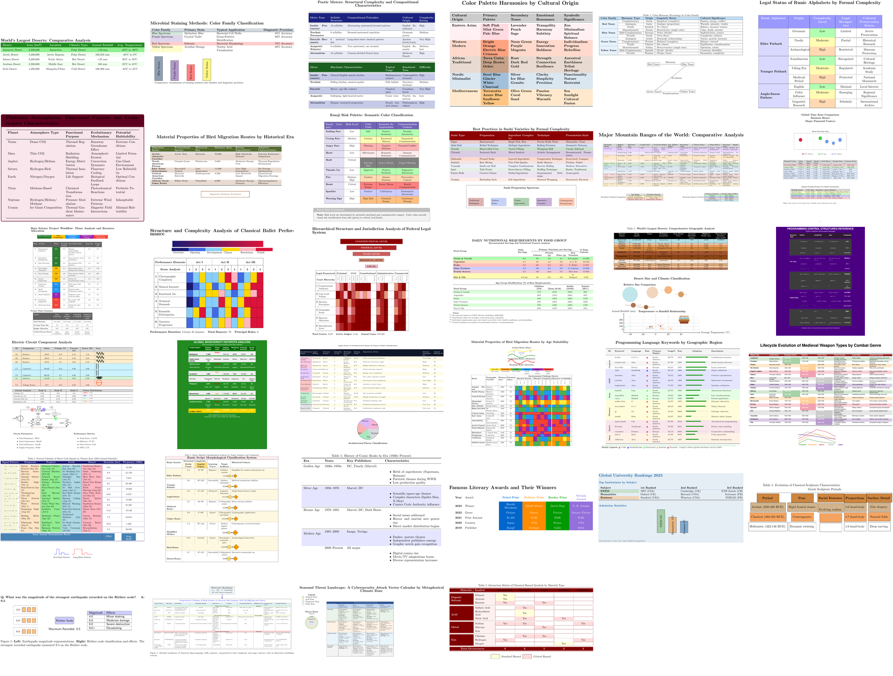

# 🧠 Visual-TableQA: Open-Domain Benchmark for Reasoning over Table Images

Welcome to **Visual-TableQA**, a project designed to generate high-quality **synthetic question-answer datasets** associated to **images of tables**. This resource is ideal for training and evaluating models on visually-grounded table understanding tasks such as **document QA**, **table parsing**, and **multimodal reasoning**.

---

## 📑 Table of Contents

- [🚀 Latest Update](#-latest-update)
- [🚀 What’s Inside](#-whats-inside)
- [🚀🚀 Getting Started](#-getting-started)
- [📁 Repository Structure](#-repository-structure)
- [🔄 Pipeline](#-pipeline)
- [📦 Setup](#-setup)
- [📤 Dataset Access](#-dataset-access)

---
## 🚀 Latest Update

We have refreshed the dataset with **newly generated QA pairs** created by stronger and more reliable LLMs, including:

- **GPT-5**
- **Claude-Sonnet-4**
- **Gemini-2.5-Pro**

### ✅ Quality Assessment

To ensure higher reliability, all QA pairs were evaluated by a **jury of advanced models**:

- **Gemini-2.5-Pro**
- **GPT-4.1**
- **Mistral-Large**
- **DeepCogito-v2**
- **DeepSeek-v3.1**

This multi-model jury setup improves consistency and reduces bias compared to earlier versions.

---

🔄 **What’s new compared to the previous release:**
- More diverse and accurate QA pairs, generated by frontier-level LLMs.
- Stronger evaluation pipeline, with cross-validation from multiple independent models.
- Higher alignment between questions and table content, with reduced hallucination rate.

We recommend using this updated release for **benchmarking visual reasoning** and **fine-tuning multimodal models**, as it provides higher quality and more trustworthy supervision signals.

---

## 🚀 What’s Inside

- 📓 **Notebook** for generating synthetic table images and their QA pairs
- 📓 **Notebook** for evaluating LLMs on this dataset
- 🖼️ Support for structured and stylized LaTeX tables or custom-designed visuals  
- 🔍 Automatic generation of questions and answers with ground-truth alignment  
- ⚡ Ready-to-use for fine-tuning LLMs, vision-language models, or benchmarking pipelines

---

## 🚀🚀 Getting Started
To quickly load and explore the dataset in Python, you can use the 🤗 `datasets` library:

```python
from datasets import load_dataset

# Load the test split of the Im2TeX dataset
dataset = load_dataset('AI-4-Everyone/Visual-TableQA')

# Print dataset info
print(dataset)
```
---

## 🔄 Pipeline

The synthetic data generation pipeline in **Visual-TableQA** follows a multi-stage process combining vision-language models (VLMs), large language models (LLMs), and structured logic:

1. **Offline Preparation**: Using table images and textual prompts, a VLM and LLM generate LaTeX-style table templates and thematic concepts.
2. **Table Synthesis**: These instructions are passed to another LLM to generate diverse structured tables in JSON format, which are then rendered into images.
3. **QA Generation**: An additional LLM generates multiple QA pairs for each table, guided by reasoning-based prompts.
4. **Validation**: A group of LLMs acts as a jury to validate the correctness and relevance of each QA pair.
5. **Export**: Validated image–question–answer triplets are saved in a standardized format, ready for training and evaluation.

The complete pipeline is illustrated below:


Here are some generated tables:

---

## 📁 Repository Structure

```text
├── Generation/TableQA.ipynb # Main notebook to generate synthetic QA
├── Gallery/ # Example generated images and records
├── Finetuning/
├── Evaluation/
├── README.md
└── LICENSE
```

## 📦 Setup

Depending on your objective, you’ll find the relevant setup instructions within the corresponding directory (e.g., Evaluation/, Finetuning/, Generation/)

## 📤 Dataset Access
You can find the generated dataset hosted on 🤗 Hugging Face:
**[Visual-TableQA](https://huggingface.co/datasets/AI-4-Everyone/Visual-TableQA)**

## Aknowledgment
We want to thank these awesome projects **[InternVL](https://github.com/OpenGVLab/InternVL/tree/main)**, **[MiniCPM-Cookbook](https://github.com/OpenSQZ/MiniCPM-V-CookBook/tree/main)**, **[ROSCOE](https://github.com/facebookresearch/ParlAI/tree/main/projects/roscoe)**, **[ReachQA](https://github.com/hewei2001/ReachQA/tree/main)**
